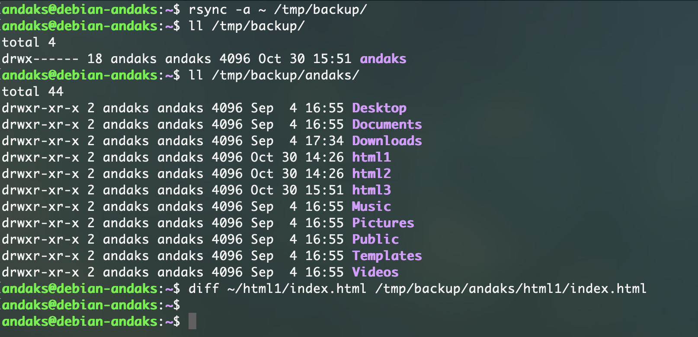
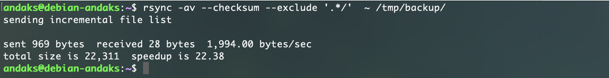
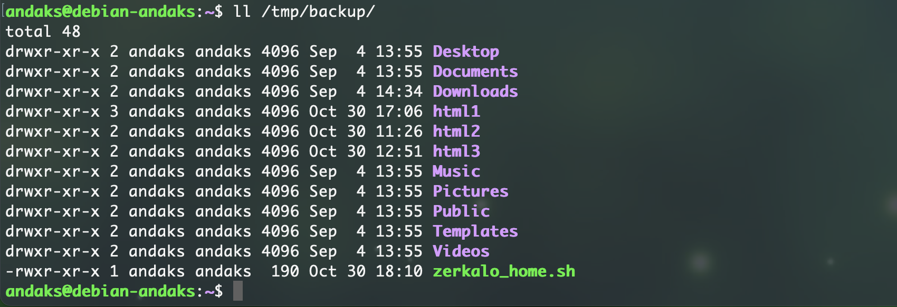

# Домашнее задание к занятию 3 «Резервное копирование» - Андрей Аксенов

### Цель задания
В результате выполнения этого задания вы научитесь:
1. Настраивать регулярные задачи на резервное копирование (полная зеркальная копия)
2. Настраивать инкрементное резервное копирование с помощью rsync

------

### Чеклист готовности к домашнему заданию

1. Установлена операционная система Ubuntu на виртуальную машину и имеется доступ к терминалу
2. Сделан клон этой виртуальной машины с другим IP адресом


------


### Задание 1
- Составьте команду rsync, которая позволяет создавать зеркальную копию домашней директории пользователя в директорию `/tmp/backup`
- Необходимо исключить из синхронизации все директории, начинающиеся с точки (скрытые)
- Необходимо сделать так, чтобы rsync подсчитывал хэш-суммы для всех файлов, даже если их время модификации и размер идентичны в источнике и приемнике.
- На проверку направить скриншот с командой и результатом ее выполнения

#### Ответ на задание 1.

- ```bash rsync -a ~ /tmp/backup/ ```



- ```bash rsync -a --exclude '.*/' ~ /tmp/backup/ ```


- ```bash rsync -av --checksum --exclude '.*/'  ~ /tmp/backup/ ```



### Задание 2
- Написать скрипт и настроить задачу на регулярное резервное копирование домашней директории пользователя с помощью rsync и cron.
- Резервная копия должна быть полностью зеркальной
- Резервная копия должна создаваться раз в день, в системном логе должна появляться запись об успешном или неуспешном выполнении операции
- Резервная копия размещается локально, в директории `/tmp/backup`
- На проверку направить файл crontab и скриншот с результатом работы утилиты.

#### Ответ на задание 2.

- crontab файл:
```bash
crontab -l
# Edit this file to introduce tasks to be run by cron.
# 
# Each task to run has to be defined through a single line
# indicating with different fields when the task will be run
# and what command to run for the task
# 
# To define the time you can provide concrete values for
# minute (m), hour (h), day of month (dom), month (mon),
# and day of week (dow) or use '*' in these fields (for 'any').
# 
# Notice that tasks will be started based on the cron's system
# daemon's notion of time and timezones.
# 
# Output of the crontab jobs (including errors) is sent through
# email to the user the crontab file belongs to (unless redirected).
# 
# For example, you can run a backup of all your user accounts
# at 5 a.m every week with:
# 0 5 * * 1 tar -zcf /var/backups/home.tgz /home/
# 
# For more information see the manual pages of crontab(5) and cron(8)
# 
# m h  dom mon dow   command
23 18 * * * bash /home/andaks/zerkalo_home.sh
```

- текст скрипта:

```bash
#!/bin/bash

rsync -a  /home/andaks/ /tmp/backup/
stat=$?

if [[ $stat -eq 0 ]]; then
	logger "RSYNC home directory was SUCCESSFUL"
else
	logger "RSYNC home directory WAS NOT successful"
fi
```

- Результат работы скрипта:


- Запись в системном лог файле:


---

## Задания со звёздочкой*
Эти задания дополнительные. Их можно не выполнять. На зачёт это не повлияет. Вы можете их выполнить, если хотите глубже разобраться в материале.

---

### Задание 3*
- Настройте ограничение на используемую пропускную способность rsync до 1 Мбит/c
- Проверьте настройку, синхронизируя большой файл между двумя серверами
- На проверку направьте команду и результат ее выполнения в виде скриншота


### Задание 4*
- Напишите скрипт, который будет производить инкрементное резервное копирование домашней директории пользователя с помощью rsync на другой сервер
- Скрипт должен удалять старые резервные копии (сохранять только последние 5 штук)
- Напишите скрипт управления резервными копиями, в нем можно выбрать резервную копию и данные восстановятся к состоянию на момент создания данной резервной копии.
- На проверку направьте скрипт и скриншоты, демонстрирующие его работу в различных сценариях.

------

### Правила приема работы

1. Необходимо следовать инструкции по выполнению домашнего задания, используя для оформления репозиторий Github
2. В ответе необходимо прикладывать требуемые материалы - скриншоты, конфигурационные файлы, скрипты. Необходимые материалы для получения зачета указаны в каждом задании.


------

### Критерии оценки

- Зачет - выполнены все задания, ответы даны в развернутой форме, приложены требуемые скриншоты, конфигурационные файлы, скрипты. В выполненных заданиях нет противоречий и нарушения логики
- На доработку - задание выполнено частично или не выполнено, в логике выполнения заданий есть противоречия, существенные недостатки, приложены не все требуемые материалы.
